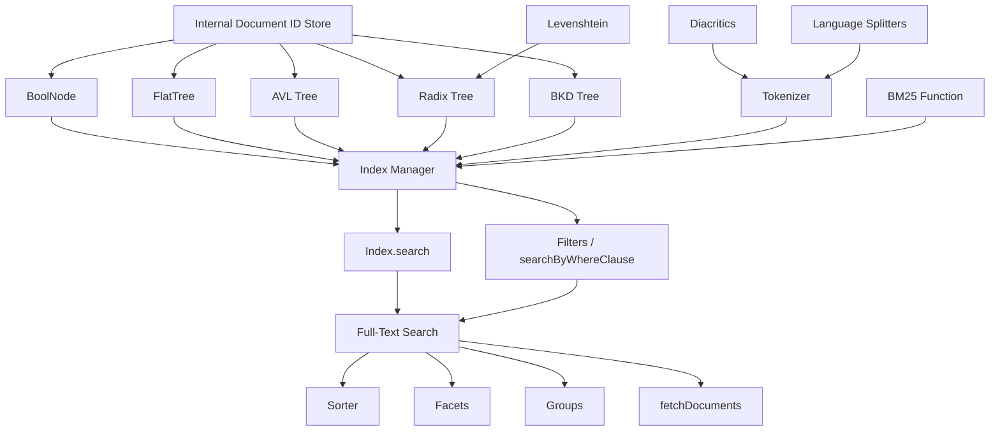

# Orama Phase 2: Implementation Guide for Searchlight

> **Purpose**: Faithful description of Orama's algorithms, data structures, and control flow
> for text processing, indexing, search, filtering, facets, sorting, grouping, and fuzzy matching.
> This document is ground truth for Dart reimplementation.
>
> **Source version**: Orama OSS, as cloned into `reference/orama/packages/orama/src/`
>
> **Date**: 2026-03-25

---

## Table of Contents

1. [Radix Tree (Text Indexing)](#1-radix-tree-text-indexing)
2. [AVL Tree (Numeric Index)](#2-avl-tree-numeric-index)
3. [Boolean Index](#3-boolean-index)
4. [Flat Index (Enum)](#4-flat-index-enum)
5. [BKD Tree (Geopoint)](#5-bkd-tree-geopoint)
6. [Zip Tree](#6-zip-tree)
7. [Index Manager (Orchestration)](#7-index-manager-orchestration)
8. [Tokenizer Pipeline](#8-tokenizer-pipeline)
9. [BM25 Scoring](#9-bm25-scoring)
10. [Full-Text Search Flow](#10-full-text-search-flow)
11. [Levenshtein / Fuzzy Matching](#11-levenshtein--fuzzy-matching)
12. [Filters](#12-filters)
13. [Facets](#13-facets)
14. [Groups](#14-groups)
15. [Sorter](#15-sorter)
16. [Internal Document ID Store](#16-internal-document-id-store)
17. [Recommended Implementation Order](#17-recommended-implementation-order)

---

## 1. Radix Tree (Text Indexing)

**Source files:** `trees/radix.ts`

### Data Structures

```
RadixNode {
  k: string          // Key — first character of this node's sub-word (edge label start)
  s: string          // Sub-word — the full edge label (compressed path segment)
  c: Map<string, RadixNode>  // Children, keyed by first character of child edge
  d: Set<InternalDocumentID> // Document IDs stored at this node
  e: boolean         // End flag — true if this node represents a complete word
  w: string          // Word — the full accumulated word from root to this node
}

RadixTree extends RadixNode {
  // Root node with k='', s='', e=false, w=''
}

FindResult = Record<string, InternalDocumentID[]>
// Maps matched words -> list of document IDs
```

### Insert Algorithm

`RadixNode.insert(word: string, docId: InternalDocumentID)`

```
PROCEDURE insert(word, docId):
  node = this (root)
  i = 0

  WHILE i < word.length:
    currentChar = word[i]
    childNode = node.children.get(currentChar)

    IF childNode exists:
      edgeLabel = childNode.s
      j = 0

      // Find common prefix length between edgeLabel and remaining word
      WHILE j < edgeLabel.length AND (i + j) < word.length AND edgeLabel[j] == word[i + j]:
        j++

      IF j == edgeLabel.length:
        // Edge label fully matched; descend to child
        node = childNode
        i += j
        IF i == word.length:
          // Word is prefix of existing word — mark node as end
          childNode.e = true
          childNode.addDocument(docId)
          RETURN
        CONTINUE

      // Partial match — SPLIT the edge at common prefix
      commonPrefix = edgeLabel[0..j]
      newEdgeLabel = edgeLabel[j..]
      newWordLabel = word[(i+j)..]

      // Create intermediate node for common prefix
      inbetweenNode = new RadixNode(commonPrefix[0], commonPrefix, false)
      node.children.set(commonPrefix[0], inbetweenNode)
      inbetweenNode.w = node.w + commonPrefix

      // Re-attach existing child under intermediate node
      childNode.s = newEdgeLabel
      childNode.k = newEdgeLabel[0]
      inbetweenNode.children.set(newEdgeLabel[0], childNode)
      childNode.w = inbetweenNode.w + newEdgeLabel

      IF newWordLabel is not empty:
        // Create new node for remaining word
        newNode = new RadixNode(newWordLabel[0], newWordLabel, true)
        newNode.addDocument(docId)
        inbetweenNode.children.set(newWordLabel[0], newNode)
        newNode.w = inbetweenNode.w + newWordLabel
      ELSE:
        // Word ends at the intermediate node
        inbetweenNode.e = true
        inbetweenNode.addDocument(docId)
      RETURN

    ELSE:
      // No matching child — create new leaf
      newNode = new RadixNode(currentChar, word[i..], true)
      newNode.addDocument(docId)
      node.children.set(currentChar, newNode)
      newNode.w = node.w + word[i..]
      RETURN

  // Word already exists in tree exactly
  node.e = true
  node.addDocument(docId)
```

### Find Algorithm (Prefix/Exact Search)

`RadixNode.find({ term, exact, tolerance })`

```
PROCEDURE find(term, exact, tolerance):
  IF tolerance AND NOT exact:
    // Fuzzy search path — see Levenshtein section
    output = {}
    _findLevenshtein(term, 0, tolerance, tolerance, output)
    RETURN output

  // Prefix / exact search path
  node = this (root)
  i = 0

  WHILE i < term.length:
    char = term[i]
    childNode = node.children.get(char)

    IF childNode:
      edgeLabel = childNode.s
      j = 0

      WHILE j < edgeLabel.length AND (i + j) < term.length AND edgeLabel[j] == term[i + j]:
        j++

      IF j == edgeLabel.length:
        // Full edge match, descend
        node = childNode
        i += j
      ELSE IF (i + j) == term.length:
        // Term ends mid-edge — this is a PREFIX match
        IF j == (term.length - i):
          IF exact: RETURN {}  // Exact mode needs complete node match
          // Collect all words in childNode's subtree
          output = {}
          childNode.findAllWords(output, term, exact, tolerance)
          RETURN output
        ELSE:
          RETURN {}  // Mismatch
      ELSE:
        RETURN {}    // Mismatch in edge

    ELSE:
      RETURN {}      // No matching child

  // Term fully matched at `node`
  output = {}
  node.findAllWords(output, term, exact, tolerance)
  RETURN output
```

### findAllWords (Subtree Collection)

Iterative DFS using a stack. Collects all words in the subtree.

```
PROCEDURE findAllWords(output, term, exact, tolerance):
  stack = [this]

  WHILE stack is not empty:
    node = stack.pop()

    IF node.e (is end-of-word):
      word = node.w
      docIDs = node.d

      IF exact AND word != term: CONTINUE

      IF word NOT in output:
        IF tolerance:
          diff = abs(term.length - word.length)
          IF diff <= tolerance AND boundedLevenshtein(term, word, tolerance).isBounded:
            output[word] = []
          ELSE:
            CONTINUE
        ELSE:
          output[word] = []

      IF word in output AND docIDs.size > 0:
        FOR each docID in docIDs:
          IF docID not already in output[word]:
            output[word].push(docID)

    // Push all children onto stack
    IF node.children.size > 0:
      stack.push(...node.children.values())
```

### Fuzzy Find (Levenshtein Traversal)

`_findLevenshtein(term, index, tolerance, originalTolerance, output)`

Iterative DFS exploring edit-distance paths through the tree:

```
PROCEDURE _findLevenshtein(term, startIndex, startTolerance, originalTolerance, output):
  stack = [{node: this, index: startIndex, tolerance: startTolerance}]

  WHILE stack is not empty:
    {node, index, tolerance} = stack.pop()

    // If node's accumulated word starts with term, collect entire subtree
    IF node.w.startsWith(term):
      node.findAllWords(output, term, false, 0)
      CONTINUE

    IF tolerance < 0: CONTINUE

    IF node.e:
      word = node.w
      IF word is not empty:
        IF boundedLevenshtein(term, word, originalTolerance).isBounded:
          output[word] = []
        IF word in output AND node.d.size > 0:
          // Merge doc IDs (using Set for dedup)
          docs = Set(output[word])
          FOR docID in node.d: docs.add(docID)
          output[word] = Array.from(docs)

    IF index >= term.length: CONTINUE

    currentChar = term[index]

    // 1. Exact match: follow matching child
    IF node.children.has(currentChar):
      stack.push({node: children.get(currentChar), index: index+1, tolerance})

    // 2. DELETE operation: skip character in search term
    stack.push({node, index: index+1, tolerance: tolerance-1})

    // 3. For each child:
    FOR [character, childNode] of node.children:
      // INSERT operation: consume child without advancing term index
      stack.push({childNode, index, tolerance: tolerance-1})
      // SUBSTITUTE operation: consume both child and term char
      IF character != currentChar:
        stack.push({childNode, index: index+1, tolerance: tolerance-1})
```

### Remove Operations

**removeDocumentByWord(term, docID, exact=true)**: Traverses tree to find the node for `term`, then calls `node.d.delete(docID)`. If `exact` is true, only removes from the node whose `w` exactly matches `term`. If `exact` is false, removes from every node along the path.

**removeWord(term)**: Traverses to the node, clears its document set, sets `e=false`, then walks back up the path cleaning up nodes that have no children, no documents, and are not end-of-word.

### Serialization

`toJSON()` produces `{w, s, e, k, d: [...docIDs], c: [[key, childJSON], ...]}`.
`fromJSON()` reconstructs from this format.

### Dart Implementation Notes

- `RadixNode.c` uses JS `Map<string, RadixNode>` — Dart: `Map<String, RadixNode>`.
- `RadixNode.d` uses JS `Set<number>` — Dart: `Set<int>`.
- The `getOwnProperty` utility checks for prototype pollution on plain objects — not needed in Dart since Dart Maps don't have prototype chains.
- Single-character indexing into strings: Dart uses `string[i]` or `string.codeUnitAt(i)`. Orama indexes by character (`word[i]`), which returns a one-character string in JS. In Dart, `string[i]` also returns a single character string.

---

## 2. AVL Tree (Numeric Index)

**Source files:** `trees/avl.ts`

### Data Structures

```
AVLNode<K, V> {
  k: K                           // Key (number for index usage)
  v: Set<V>                      // Values — Set of InternalDocumentIDs
  l: AVLNode<K, V> | null        // Left child
  r: AVLNode<K, V> | null        // Right child
  h: number                      // Height (starts at 1 for leaf)
}

AVLTree<K, V> {
  root: AVLNode<K, V> | null
  insertCount: number            // Tracks inserts for deferred rebalancing
}
```

### Key Design: Deferred Rebalancing

The AVL tree uses a **deferred rebalancing** strategy controlled by a `rebalanceThreshold` parameter (default: 1, meaning rebalance every insert). During bulk inserts (`insertMultiple`), the threshold is set to the batch size, so rebalancing only happens every N inserts. This dramatically improves bulk insert performance.

```
insertCount % rebalanceThreshold == 0  =>  trigger rebalance on the path
```

### Insert Algorithm

```
PROCEDURE insert(key, value, rebalanceThreshold=1):
  IF root is null:
    root = new AVLNode(key, [value])
    RETURN

  // Iterative BST insertion tracking path
  path = []
  current = root, parent = null

  WHILE current is not null:
    path.push({parent, current})

    IF key < current.k:
      IF current.l is null:
        current.l = new AVLNode(key, [value])
        path.push({parent: current, node: current.l})
        BREAK
      parent = current; current = current.l

    ELSE IF key > current.k:
      IF current.r is null:
        current.r = new AVLNode(key, [value])
        path.push({parent: current, node: current.r})
        BREAK
      parent = current; current = current.r

    ELSE:
      // Key exists — add value to existing set
      current.v.add(value)
      RETURN root

  // Walk path backwards, update heights, conditionally rebalance
  needRebalance = (insertCount++ % rebalanceThreshold == 0)

  FOR i = path.length-1 DOWNTO 0:
    {parent, currentNode} = path[i]
    currentNode.updateHeight()

    IF needRebalance:
      rebalancedNode = rebalanceNode(currentNode)
      // Reattach rebalanced subtree to parent
      IF parent: fix parent's child pointer
      ELSE: root = rebalancedNode
```

### Rebalance Algorithm (Standard AVL)

```
PROCEDURE rebalanceNode(node):
  balanceFactor = height(node.l) - height(node.r)

  IF balanceFactor > 1:    // Left heavy
    IF node.l.balanceFactor >= 0: RETURN rotateRight(node)         // LL case
    ELSE: node.l = rotateLeft(node.l); RETURN rotateRight(node)     // LR case

  IF balanceFactor < -1:   // Right heavy
    IF node.r.balanceFactor <= 0: RETURN rotateLeft(node)          // RR case
    ELSE: node.r = rotateRight(node.r); RETURN rotateLeft(node)    // RL case

  RETURN node
```

### Rotation

Standard AVL rotations — `rotateLeft` and `rotateRight` — updating heights after rotation.

### Query Operations

All query methods use **iterative in-order traversal** with a stack:

- **`find(key)`**: Standard BST lookup. Returns `Set<V>` or null.
- **`rangeSearch(min, max)`**: In-order traversal, collecting values where `min <= key <= max`. Early exit when `key > max`.
- **`greaterThan(key, inclusive=false)`**: Reverse in-order (right-first), collecting where `key > threshold` (or `>=`). Early exit when `key <= threshold`.
- **`lessThan(key, inclusive=false)`**: In-order (left-first), collecting where `key < threshold` (or `<=`). Early exit when `key > threshold`.

### Remove Operations

- **`remove(key)`**: Standard BST removal (find in-order successor for two-child case), then rebalance path.
- **`removeDocument(key, id)`**: Finds node by key. If node has only one value, removes the entire node. Otherwise, filters the value from the Set.

### Important Constants

- Default `rebalanceThreshold`: 1 (rebalance every insert)
- Batch insert threshold: set to batch size (e.g., 1000)
- Height of a null node: 0
- Height of a leaf: 1

### Dart Implementation Notes

- `AVLNode.v` is a `Set<V>` — use Dart `Set<int>`.
- Generic `K` is compared with `<` and `>` operators; Dart numerics support this natively via `Comparable`.
- The `insertCount` field must be tracked on the tree, not the node.

---

## 3. Boolean Index

**Source files:** `trees/bool.ts`

### Data Structure

```
BoolNode<V> {
  true: Set<V>       // Document IDs where field value is true
  false: Set<V>      // Document IDs where field value is false
}
```

### Operations

Trivially simple — two sets:

- **`insert(value, bool)`**: Add value to `this.true` or `this.false` based on `bool`.
- **`delete(value, bool)`**: Remove value from the appropriate set.
- **`getSize()`**: Sum of both set sizes.

### Filter Behavior (at Index Manager level)

When filtering on a boolean field:
```
operation = true  =>  return this.true set
operation = false =>  return this.false set
```

### Dart Implementation Notes

- Straightforward. Use two `Set<int>` fields.

---

## 4. Flat Index (Enum)

**Source files:** `trees/flat.ts`

### Data Structure

```
FlatTree {
  numberToDocumentId: Map<ScalarSearchableValue, Set<InternalDocumentID>>
  // Maps enum values (string | number | boolean) to sets of document IDs
}
```

Despite the field name `numberToDocumentId`, this stores **any scalar searchable value** as keys (strings, numbers, booleans).

### Operations

- **`insert(key, value)`**: Add document ID to the set for key. Create set if not exists.
- **`find(key)`**: Return array of document IDs for key, or null.
- **`remove(key)`**: Delete the entire key entry.
- **`removeDocument(id, key)`**: Remove one document ID from the key's set. If set becomes empty, delete the key.
- **`contains(key)`**: Check if key exists.
- **`getSize()`**: Sum of all set sizes.

### Filter Operations

**`filter(operation: EnumComparisonOperator)`** — single-value enum fields:

```
SWITCH operation type:
  'eq':  return docs matching exact value
  'in':  return union of docs matching any value in the list
  'nin': return all docs whose key is NOT in the exclude list
```

**`filterArr(operation: EnumArrComparisonOperator)`** — array enum fields:

```
SWITCH operation type:
  'containsAll': return intersection of doc sets for all values (AND)
  'containsAny': return union of doc sets for all values (OR)
```

### Dart Implementation Notes

- Key type is `ScalarSearchableValue` = `string | number | boolean`. In Dart, use `Object` as key type or a union type.
- `Map<Object, Set<int>>` is the natural Dart equivalent.

---

## 5. BKD Tree (Geopoint)

**Source files:** `trees/bkd.ts`

### Data Structures

```
Point {
  lon: number    // Longitude
  lat: number    // Latitude
}

BKDNode {
  point: Point
  docIDs: Set<InternalDocumentID>
  left: BKDNode | null
  right: BKDNode | null
  parent: BKDNode | null
}

BKDTree {
  root: BKDNode | null
  nodeMap: Map<string, BKDNode>    // "lon,lat" -> node for O(1) lookup
}
```

### Constants

```
K = 2                    // 2D points (lon, lat)
EARTH_RADIUS = 6371e3    // Earth radius in meters (6,371,000)
```

### Insert Algorithm

This is a standard **KD-tree** insertion (despite the name "BKD"):

```
PROCEDURE insert(point, docIDs):
  pointKey = "${point.lon},${point.lat}"

  // If point already exists, merge document IDs
  IF nodeMap.has(pointKey):
    existingNode.docIDs.addAll(docIDs)
    RETURN

  newNode = new BKDNode(point, docIDs)
  nodeMap.set(pointKey, newNode)

  IF root is null:
    root = newNode
    RETURN

  // KD-tree descent: alternate between lon (depth%2==0) and lat (depth%2==1)
  node = root, depth = 0

  LOOP:
    axis = depth % K   // 0 = lon, 1 = lat

    IF axis == 0:
      compare point.lon vs node.point.lon
    ELSE:
      compare point.lat vs node.point.lat

    // Go left if less, right if greater-or-equal
    IF value < node_value:
      IF node.left is null: node.left = newNode; newNode.parent = node; RETURN
      node = node.left
    ELSE:
      IF node.right is null: node.right = newNode; newNode.parent = node; RETURN
      node = node.right

    depth++
```

### Search by Radius

```
PROCEDURE searchByRadius(center, radius, inclusive=true, sort='asc', highPrecision=false):
  distanceFn = highPrecision ? vincentyDistance : haversineDistance
  stack = [{node: root, depth: 0}]
  result = []

  // Full tree traversal (no spatial pruning!)
  WHILE stack is not empty:
    {node, depth} = stack.pop()
    IF node is null: CONTINUE

    dist = distanceFn(center, node.point)

    IF inclusive ? (dist <= radius) : (dist > radius):
      result.push({point: node.point, docIDs: Array.from(node.docIDs)})

    IF node.left: stack.push({node.left, depth+1})
    IF node.right: stack.push({node.right, depth+1})

  // Sort results by distance
  IF sort:
    result.sort by distance (asc or desc)

  RETURN result
```

**Important**: The radius search does **NOT** perform spatial pruning. It visits every node in the tree. This is a brute-force search with KD-tree structure used only for insertion ordering.

### Search by Polygon

```
PROCEDURE searchByPolygon(polygon, inclusive=true, sort=null, highPrecision=false):
  // Full tree traversal
  FOR each node:
    isInside = isPointInPolygon(polygon, node.point)
    IF (isInside AND inclusive) OR (NOT isInside AND NOT inclusive):
      add to result

  // Sort by distance to polygon centroid if sort requested
  centroid = calculatePolygonCentroid(polygon)
  IF sort: sort results by distance to centroid
```

### Distance Functions

**Haversine Distance** (default, faster):
```
haversineDistance(coord1, coord2):
  P = pi/180
  lat1 = coord1.lat * P, lat2 = coord2.lat * P
  deltaLat = (coord2.lat - coord1.lat) * P
  deltaLon = (coord2.lon - coord1.lon) * P

  a = sin(deltaLat/2)^2 + cos(lat1) * cos(lat2) * sin(deltaLon/2)^2
  c = 2 * atan2(sqrt(a), sqrt(1-a))

  RETURN EARTH_RADIUS * c   // Result in meters
```

**Vincenty Distance** (high precision):
Full iterative Vincenty formula with WGS84 ellipsoid parameters:
- Semi-major axis `a = 6378137`
- Flattening `f = 1/298.257223563`
- Semi-minor axis `b = (1-f) * a`
- Iteration limit: 1000
- Convergence threshold: `1e-12`

### Point-in-Polygon (Ray Casting)

Standard ray-casting algorithm:
```
PROCEDURE isPointInPolygon(polygon, point):
  isInside = false
  x = point.lon, y = point.lat

  FOR i=0, j=polygon.length-1; i<polygon.length; j=i++:
    xi, yi = polygon[i].lon, polygon[i].lat
    xj, yj = polygon[j].lon, polygon[j].lat

    intersect = (yi > y) != (yj > y) AND x < ((xj-xi)*(y-yi))/(yj-yi) + xi
    IF intersect: isInside = !isInside

  RETURN isInside
```

### Polygon Centroid (Shoelace Formula)

```
PROCEDURE calculatePolygonCentroid(polygon):
  totalArea = 0, centroidX = 0, centroidY = 0

  FOR i=0, j=length-1; i<length; j=i++:
    areaSegment = polygon[i].lon * polygon[j].lat - polygon[j].lon * polygon[i].lat
    totalArea += areaSegment
    centroidX += (polygon[i].lon + polygon[j].lon) * areaSegment
    centroidY += (polygon[i].lat + polygon[j].lat) * areaSegment

  totalArea /= 2
  factor = 6 * totalArea
  RETURN {lon: centroidX/factor, lat: centroidY/factor}
```

### Remove

```
removeDocByID(point, docID):
  Find node via nodeMap
  Remove docID from node.docIDs
  IF node.docIDs is empty:
    Remove from nodeMap
    deleteNode(node)  // Simple BST deletion (replace with single child)
```

### Dart Implementation Notes

- `nodeMap` uses string key `"$lon,$lat"` — same pattern in Dart.
- The `parent` pointer on BKDNode enables O(1) deletion but adds memory overhead.
- Dart `dart:math` provides `sin`, `cos`, `atan2`, `sqrt`, `pi`.

---

## 6. Zip Tree

**Source files:** `trees/zip.ts`

### Data Structure

```
ZipNode<V> {
  k: number             // Key
  v: V                  // Value (single value, not a set)
  n: number             // Rank (random, geometric distribution)
  l: ZipNode<V> | null  // Left child
  r: ZipNode<V> | null  // Right child
  p: ZipNode<V> | null  // Parent
}

ZipTree<V> {
  root: ZipNode<V> | null
}
```

### Key Concept

A **Zip Tree** is a randomized BST that maintains a **max-heap property on ranks**. Ranks are drawn from a geometric distribution, which provides expected O(log n) height.

### Rank Generation

```
randomRank():
  r = Math.random()           // Uniform [0, 1)
  RETURN floor(ln(1-r) / ln(0.5))  // Geometric distribution with p=0.5
```

### Insert

```
PROCEDURE insert(key, value):
  newNode = new ZipNode(key, value, randomRank())

  // Standard BST insertion
  Find position via BST comparison
  IF key already exists: update value, RETURN

  Attach newNode to parent

  // Bubble up: rotate until heap property restored
  WHILE newNode.parent exists AND newNode.parent.rank < newNode.rank:
    IF newNode is left child: rotateRight(parent)
    ELSE: rotateLeft(parent)

  IF newNode.parent is null: root = newNode
```

### Usage in Orama

The Zip Tree is exported but **not used by the default index manager**. It exists in the tree library but the Index Manager (`components/index.ts`) only creates AVL, Radix, Bool, Flat, and BKD trees. The Zip Tree may be used by plugins or custom implementations.

### Dart Implementation Notes

- If implementing, use Dart's `Random` for rank generation.
- The `removeDocument` method handles both single values and array values — check if `v` is a List before removing.

---

## 7. Index Manager (Orchestration)

**Source files:** `components/index.ts`

### Data Structures

```
Index {
  sharedInternalDocumentStore: InternalDocumentIDStore
  indexes: Record<string, Tree>     // Property path -> typed tree wrapper
  searchableProperties: string[]    // Flat list of all indexed property paths
  searchablePropertiesWithTypes: Record<string, SearchableType>
  frequencies: FrequencyMap         // Per-property, per-doc, per-token TF values
  tokenOccurrences: Record<string, Record<string, number>>  // Per-property token -> doc count
  avgFieldLength: Record<string, number>  // Per-property average token count
  fieldLengths: Record<string, Record<InternalDocumentID, number>>  // Per-property, per-doc token count
}

Tree = { type: TreeType, node: TreeNode, isArray: boolean }
TreeType = 'AVL' | 'Radix' | 'Bool' | 'Flat' | 'BKD'

FrequencyMap = {
  [property: string]: {
    [documentID: InternalDocumentID]: {
      [token: string]: number    // Term frequency (tf = count/total)
    } | undefined
  }
}
```

### Schema-to-Tree Mapping

```
'boolean' | 'boolean[]' => BoolNode    (type: 'Bool')
'number'  | 'number[]'  => AVLTree     (type: 'AVL', initialized with key=0, value=[])
'string'  | 'string[]'  => RadixTree   (type: 'Radix')
'enum'    | 'enum[]'    => FlatTree    (type: 'Flat')
'geopoint'              => BKDTree     (type: 'BKD')
```

The `isArray` flag is set to `true` when the schema type contains `[]`.

For string types, the index also initializes:
- `avgFieldLength[path] = 0`
- `frequencies[path] = {}`
- `tokenOccurrences[path] = {}`
- `fieldLengths[path] = {}`

### Create Index

```
PROCEDURE create(orama, store, schema, index=null, prefix=''):
  IF index is null: initialize empty Index

  FOR each [prop, type] in schema:
    path = prefix ? "${prefix}.${prop}" : prop

    IF type is object (nested schema):
      RECURSE: create(orama, store, type, index, path)
      CONTINUE

    IF type is vector: create VectorIndex
    ELSE:
      SWITCH type:
        boolean/boolean[] => Bool
        number/number[]   => AVL
        string/string[]   => Radix (+ init BM25 structures)
        enum/enum[]       => Flat
        geopoint          => BKD

    Add path to searchableProperties
    Record type in searchablePropertiesWithTypes
```

### Insert into Index (per property)

`insert(implementation, index, prop, id, internalId, value, schemaType, language, tokenizer, docsCount, options)`

For **array types**, iterates over each element and calls `insertScalar` for each.

**insertScalar** dispatches by tree type:

```
SWITCH tree.type:
  'Bool':
    node[value ? 'true' : 'false'].add(internalId)

  'AVL':
    node.insert(value, internalId, avlRebalanceThreshold)

  'Radix':
    tokens = tokenizer.tokenize(value, language, prop, false)
    insertDocumentScoreParameters(index, prop, internalId, tokens, docsCount)
    FOR each token in tokens:
      insertTokenScoreParameters(index, prop, internalId, tokens, token)
      node.insert(token, internalId)

  'Flat':
    node.insert(value, internalId)

  'BKD':
    node.insert(value_as_Point, [internalId])
```

### BM25 Score Parameter Maintenance

**insertDocumentScoreParameters(index, prop, id, tokens, docsCount)**:
```
// Running average of field lengths
avgFieldLength[prop] = (avgFieldLength[prop] * (docsCount-1) + tokens.length) / docsCount
fieldLengths[prop][internalId] = tokens.length
frequencies[prop][internalId] = {}    // Initialize empty frequency map for this doc
```

**insertTokenScoreParameters(index, prop, id, tokens, token)**:
```
// Count how many times this token appears in the token list
tokenFrequency = count occurrences of token in tokens
tf = tokenFrequency / tokens.length

frequencies[prop][internalId][token] = tf

// Increment document frequency for this token
tokenOccurrences[prop][token] = (tokenOccurrences[prop][token] ?? 0) + 1
```

### Remove from Index

Mirror of insert — dispatches by tree type. For Radix:
```
tokens = tokenizer.tokenize(value, language, prop)
removeDocumentScoreParameters(index, prop, id, docsCount)
FOR each token:
  removeTokenScoreParameters(index, prop, token)   // Decrement tokenOccurrences
  node.removeDocumentByWord(token, internalId)
```

**removeDocumentScoreParameters**:
```
IF docsCount > 1:
  avgFieldLength[prop] = (avg * docsCount - fieldLengths[prop][id]) / (docsCount - 1)
ELSE:
  avgFieldLength[prop] = undefined

fieldLengths[prop][id] = undefined
frequencies[prop][id] = undefined
```

### Search (Index-Level)

`search(index, term, tokenizer, language, propertiesToSearch, exact, tolerance, boost, relevance, docsCount, whereFiltersIDs, threshold)`

```
PROCEDURE search(...):
  tokens = tokenizer.tokenize(term, language)
  keywordsCount = tokens.length || 1
  keywordMatchesMap = Map<InternalDocumentID, Map<string, number>>
  tokenFoundMap = Map<string, boolean>
  resultsMap = Map<number, number>

  FOR each prop in propertiesToSearch:
    tree = index.indexes[prop]
    ASSERT tree.type == 'Radix'
    boostPerProperty = boost[prop] ?? 1
    ASSERT boostPerProperty > 0

    IF tokens is empty AND term is empty: tokens.push('')

    FOR each token in tokens:
      searchResult = tree.node.find({term: token, exact, tolerance})
      termsFound = Object.keys(searchResult)

      IF termsFound.length > 0: tokenFoundMap.set(token, true)

      FOR each word in termsFound:
        ids = searchResult[word]
        calculateResultScores(index, prop, word, ids, docsCount,
          relevance, resultsMap, boostPerProperty, whereFiltersIDs, keywordMatchesMap)

  // Convert to sorted array
  results = Array.from(resultsMap).map([id, score]).sort by score DESC

  // Apply threshold logic:
  IF threshold == 1: RETURN results

  IF threshold == 0:
    IF keywordsCount == 1: RETURN results
    // Verify ALL tokens were found
    FOR each token: IF NOT found: RETURN []
    // Filter to docs that have all keywords in at least one property
    RETURN results.filter(doc has keywordsCount matches in some property)

  // 0 < threshold < 1:
  // Return full matches + (threshold * partial matches)
  fullMatches = filter docs with all keywords in some property
  IF fullMatches exist:
    remaining = results - fullMatches
    additional = ceil(remaining.length * threshold)
    RETURN [...fullMatches, ...remaining[0..additional]]
  RETURN results
```

### calculateResultScores

```
PROCEDURE calculateResultScores(index, prop, term, ids, docsCount, bm25Params, resultsMap, boost, whereFiltersIDs, keywordMatchesMap):
  avgFieldLength = index.avgFieldLength[prop]
  fieldLengths = index.fieldLengths[prop]
  tokenOccurrences = index.tokenOccurrences[prop][term] (as number, or 0)

  FOR each internalId in ids:
    IF whereFiltersIDs exists AND internalId not in whereFiltersIDs: SKIP

    // Track keyword matches per property
    keywordMatchesMap[internalId][prop] += 1

    tf = frequencies[prop][internalId][term] ?? 0
    bm25Score = BM25(tf, tokenOccurrences, docsCount, fieldLengths[internalId], avgFieldLength, bm25Params)

    resultsMap[internalId] = (existing score ?? 0) + bm25Score * boost
```

### Dart Implementation Notes

- `FrequencyMap` is deeply nested — consider using a class or nested maps.
- `Record<string, Tree>` maps to `Map<String, Tree>`.
- The `IIndex` interface pattern can be modeled with a Dart `interface class`.

---

## 8. Tokenizer Pipeline

**Source files:** `components/tokenizer/index.ts`, `components/tokenizer/diacritics.ts`, `components/tokenizer/languages.ts`

### Tokenizer Configuration

```
DefaultTokenizer {
  language: Language                    // e.g., 'english'
  stemmer?: (word: string) => string   // Optional stemming function
  stemmerSkipProperties: Set<string>   // Properties to skip stemming for
  tokenizeSkipProperties: Set<string>  // Properties where entire value = single token
  stopWords?: string[]                 // Words to remove
  allowDuplicates: boolean             // If false, deduplicate tokens (default: false)
  normalizationCache: Map<string, string>  // Cache: "lang:prop:token" -> normalized token
}
```

### Tokenization Flow

```
PROCEDURE tokenize(input, language, prop, withCache=true):
  IF language provided AND != this.language: throw error

  IF input is not string: RETURN [input]

  normalizeToken = this.normalizeToken.bind(this, prop ?? '')

  IF prop AND prop in tokenizeSkipProperties:
    // Do NOT split — treat entire input as one token
    tokens = [normalizeToken(input, withCache)]
  ELSE:
    splitRule = SPLITTERS[this.language]     // Language-specific regex
    tokens = input
      .toLowerCase()                         // Step 1: Lowercase
      .split(splitRule)                      // Step 2: Split on regex
      .map(t => normalizeToken(t, withCache)) // Step 3: Normalize each token
      .filter(Boolean)                       // Step 4: Remove empty strings

  tokens = trim(tokens)  // Remove leading/trailing empty strings

  IF NOT allowDuplicates:
    tokens = Array.from(new Set(tokens))    // Step 5: Deduplicate

  RETURN tokens
```

### Token Normalization

```
PROCEDURE normalizeToken(prop, token, withCache=true):
  key = "${language}:${prop}:${token}"

  IF withCache AND cache has key: RETURN cached value

  // Step 1: Stop word removal
  IF stopWords includes token:
    cache key -> ''
    RETURN ''

  // Step 2: Stemming (if enabled and property not skipped)
  IF stemmer AND prop NOT in stemmerSkipProperties:
    token = stemmer(token)

  // Step 3: Diacritic replacement
  token = replaceDiacritics(token)

  cache key -> token
  RETURN token
```

### Diacritic Replacement

Character-by-character replacement using a lookup table:

```
DIACRITICS_CHARCODE_START = 192    // Unicode 0xC0 (A-grave)
DIACRITICS_CHARCODE_END = 383      // Unicode 0x17F

CHARCODE_REPLACE_MAPPING = [
  // 192 entries mapping accented chars to their ASCII base
  // e.g., A-with-grave (192) -> A (65)
  // e.g., a-with-acute (225) -> a (97)
  // etc.
]

PROCEDURE replaceDiacritics(str):
  FOR each character in str:
    charCode = str.charCodeAt(idx)
    IF charCode >= 192 AND charCode <= 383:
      replacement = CHARCODE_REPLACE_MAPPING[charCode - 192]
      IF replacement: use replacement
    ELSE:
      keep original charCode
  RETURN String.fromCharCode(...result)
```

### Language Splitters

Each language has a custom regex. Examples:

| Language | Regex Pattern |
|----------|--------------|
| English  | `/[^A-Za-z\u00E0\u00E8\u00E9\u00EC\u00F2\u00F3\u00F9 0-9_'-]+/gim` |
| French   | `/[^a-z0-9\u00E4\u00E2\u00E0\u00E9\u00E8\u00EB\u00EA\u00EF\u00EE\u00F6\u00F4\u00F9\u00FC\u00FB\u0153\u00E7-]+/gim` |
| German   | `/[^a-z0-9A-Z\u00E4\u00F6\u00FC\u00C4\u00D6\u00DC\u00DF]+/gim` |

The pattern is: **split on characters NOT in the allowed set**.

### Stemming

- Disabled by default (`stemming` must be explicitly set to `true` or a `stemmer` function provided).
- A built-in English stemmer exists in `english-stemmer.ts`.
- For other languages, user must provide a custom stemmer function.

### Dart Implementation Notes

- The normalization cache key format `"${language}:${prop}:${token}"` should be preserved.
- Diacritics table maps exactly from charCodes 192-383. In Dart, use `String.codeUnitAt()` and `String.fromCharCodes()`.
- Language-specific split regexes should be translated to Dart `RegExp`. Dart regexes support Unicode ranges.
- The `allowDuplicates: false` deduplication uses `Set` — order depends on insertion order, which is preserved by both JS Set and Dart `LinkedHashSet` (the default).
- **Important**: `tokenize` with `allowDuplicates: false` returns unique tokens for indexing purposes. This means the same token appearing multiple times in a field is still only indexed once per document, but the term frequency calculation (`insertTokenScoreParameters`) counts all occurrences before deduplication.

Actually, looking more carefully: `tokenize` is called **with allowDuplicates=false by default**, so the tokens array returned is deduplicated. But `insertTokenScoreParameters` counts occurrences of `token` within the deduplicated `tokens` array — which means the TF numerator is always 1. This is the actual Orama behavior.

Wait — re-reading the flow: `insertTokenScoreParameters` iterates over `tokens` (the deduplicated array) and counts how many times `token` appears. Since tokens is deduplicated, each token appears exactly once, so `tokenFrequency = 1` and `tf = 1 / tokens.length` always.

**Correction**: This is only true when `allowDuplicates` is false (the default). If `allowDuplicates` is true, TF can be > 1/length.

---

## 9. BM25 Scoring

**Source files:** `components/algorithms.ts`, `methods/search-fulltext.ts` (for defaults)

### BM25 Formula

```
FUNCTION BM25(tf, matchingCount, docsCount, fieldLength, averageFieldLength, {k, b, d}):
  idf = ln(1 + (docsCount - matchingCount + 0.5) / (matchingCount + 0.5))
  score = (idf * (d + tf * (k + 1))) / (tf + k * (1 - b + (b * fieldLength) / averageFieldLength))
  RETURN score
```

Where:
- `tf` — term frequency in the document for the specific property: `frequencies[prop][docID][token]`
- `matchingCount` — number of documents containing this token in this property: `tokenOccurrences[prop][token]`
- `docsCount` — total number of documents in the database
- `fieldLength` — number of tokens in this document's property: `fieldLengths[prop][docID]`
- `averageFieldLength` — average token count across all docs for this property: `avgFieldLength[prop]`
- `k` — term frequency saturation (default: 1.2)
- `b` — document length normalization (default: 0.75)
- `d` — frequency normalization lower bound (default: 0.5)

### Default BM25 Parameters

```
defaultBM25Params = {
  k: 1.2,
  b: 0.75,
  d: 0.5
}
```

### Score Accumulation

For a multi-token query across multiple properties:
```
FOR each property:
  boostPerProperty = boost[prop] ?? 1
  FOR each token:
    FOR each matching word in radix tree:
      FOR each document containing that word:
        bm25Score = BM25(tf, matchingCount, docsCount, fieldLen, avgFieldLen, params)
        resultsMap[docID] += bm25Score * boostPerProperty
```

Scores are **additive** across tokens and properties, multiplied by per-property boost.

### prioritizeTokenScores

`prioritizeTokenScores(arrays, boost, threshold, keywordsCount)`

This is used in other search modes (vector/hybrid) but is also part of the scoring system:

```
PROCEDURE prioritizeTokenScores(arrays, boost, threshold, keywordsCount):
  tokenScoresMap = Map<docID, [score, matchCount]>

  FOR each array in arrays:
    FOR each [token, score] in array:
      boostScore = score * boost
      IF token already in map:
        newScore = oldScore * 1.5 + boostScore    // 1.5x multiplier for repeated matches
        matchCount++
      ELSE:
        map[token] = [boostScore, 1]

  results = sort by score DESC

  // Threshold logic:
  IF threshold == 1: RETURN all results
  IF threshold == 0 AND keywordsCount == 1: RETURN all results

  // Sort by [matchCount DESC, score DESC]
  // Find last index where matchCount == keywordsCount
  // Apply threshold to select how many partial matches to include

  IF threshold == 0:
    RETURN only results where matchCount == keywordsCount

  // 0 < threshold < 1:
  thresholdLength = lastFullMatch + ceil(threshold * (total - lastFullMatch))
  RETURN results[0..thresholdLength]
```

**Important**: The `1.5` multiplier for documents matching multiple search terms is hardcoded.

### Dart Implementation Notes

- Use Dart `dart:math` for `log()` (natural logarithm).
- The BM25 formula is a single pure function — straightforward to translate.
- The `1.5` multiplier in `prioritizeTokenScores` is a magic number that must be preserved.

---

## 10. Full-Text Search Flow

**Source files:** `methods/search-fulltext.ts`, `methods/search.ts`

### High-Level Flow

```
fullTextSearch(orama, params, language):
  timeStart = now()

  // 1. Determine which string properties to search
  propertiesToSearch = all Radix-indexed properties
  IF params.properties specified: filter to those

  // 2. Apply where-clause filters (if any)
  IF params.where has keys:
    whereFiltersIDs = searchByWhereClause(index, tokenizer, where, language)

  // 3. Perform text search or return all docs
  IF term OR properties:
    threshold = params.threshold ?? 1    // DEFAULT IS 1 (return all partial matches)
    uniqueDocsIDs = index.search(index, term||'', tokenizer, language,
      propertiesToSearch, exact, tolerance, boost, relevance, docsCount,
      whereFiltersIDs, threshold)

    // Exact match post-filter: re-check original text with regex word boundaries
    IF params.exact AND term:
      searchTerms = term.split(/\s+/)
      uniqueDocsIDs = filter to docs where ALL terms appear as whole words
        in at least one searched property (case-sensitive regex \b...\b)

  ELSE IF hasFilters:
    // No search term — check for geo-only query
    geoResults = searchByGeoWhereClause(index, where)
    IF geoResults:
      uniqueDocsIDs = geoResults    // Distance-scored
    ELSE:
      uniqueDocsIDs = whereFiltersIDs as [id, 0] pairs  // Score 0

  ELSE:
    // No term, no filters — return all documents with score 0
    uniqueDocsIDs = all doc IDs as [id, 0] pairs

  // 4. Sort results
  IF params.sortBy is function:
    Fetch docs, create [id, score, doc] triples, sort with custom function
  ELSE IF params.sortBy is {property, order}:
    Use sorter.sortBy(sorting, uniqueDocsIDs, sortByParams)
    Convert DocumentIDs to InternalDocumentIDs
  ELSE:
    Sort by score DESC (ties broken by ID ASC)

  // 5. Apply pinning rules
  uniqueDocsIDs = applyPinningRules(...)

  // 6. Paginate — fetch actual documents
  IF NOT preflight:
    IF distinctOn:
      results = fetchDocumentsWithDistinct(orama, uniqueDocsIDs, offset, limit, distinctOn)
    ELSE:
      results = fetchDocuments(orama, uniqueDocsIDs, offset, limit)

  // 7. Calculate facets
  IF facets config:
    searchResult.facets = getFacets(orama, uniqueDocsIDs, facetsConfig)

  // 8. Calculate groups
  IF groupBy config:
    searchResult.groups = getGroups(orama, uniqueDocsIDs, groupBy)

  // 9. Return
  searchResult = { elapsed, hits, count: uniqueDocsIDs.length, facets?, groups? }
```

### fetchDocuments

```
PROCEDURE fetchDocuments(orama, uniqueDocsArray, offset, limit):
  results = new Array(limit)
  resultIDs = Set()

  FOR i = offset TO offset+limit-1:
    [id, score] = uniqueDocsArray[i]
    IF id not in resultIDs:
      doc = documentsStore.get(docs, id)
      results[i] = { id: externalId, score, document: doc }
      resultIDs.add(id)

  RETURN results
```

### fetchDocumentsWithDistinct

Iterates over all results, skipping documents with duplicate values for the `distinctOn` property. Respects offset and limit.

### Important Defaults

- `limit`: 10
- `offset`: 0
- `threshold`: **1** (when unspecified in fullTextSearch; note: the index.search function receives threshold as passed)
- `exact`: false
- `tolerance`: 0
- `boost`: {} (all properties boost = 1)
- `relevance`: { k: 1.2, b: 0.75, d: 0.5 }

### Dart Implementation Notes

- The exact-match post-filter uses JS regex with `\b` word boundaries. Dart `RegExp` supports `\b`.
- `getNanosecondsTime` uses `performance.now()` or `process.hrtime.bigint()` — Dart has `Stopwatch` and `DateTime`.
- The `sortTokenScorePredicate` sorts by score DESC, then by ID ASC for ties.

---

## 11. Levenshtein / Fuzzy Matching

**Source files:** `components/levenshtein.ts`

### Bounded Levenshtein Distance

`_boundedLevenshtein(term, word, tolerance)` — returns distance or -1 if exceeds tolerance.

```
PROCEDURE _boundedLevenshtein(term, word, tolerance):
  IF tolerance < 0: RETURN -1
  IF term == word: RETURN 0

  m = term.length, n = word.length

  IF m == 0: RETURN n <= tolerance ? n : -1
  IF n == 0: RETURN m <= tolerance ? m : -1

  diff = abs(m - n)

  // PREFIX OPTIMIZATION: If term starts with word, distance = remaining length
  IF term.startsWith(word):
    RETURN diff <= tolerance ? diff : -1

  // PREFIX OPTIMIZATION: If word starts with term, ANY prefix match = distance 0
  IF word.startsWith(term):
    RETURN 0

  // LENGTH DIFFERENCE CHECK
  IF diff > tolerance: RETURN -1

  // Full matrix computation
  matrix[0..m][0..n] initialized:
    matrix[i][0] = i
    matrix[0][j] = j

  FOR i = 1 TO m:
    rowMin = Infinity
    FOR j = 1 TO n:
      IF term[i-1] == word[j-1]:
        matrix[i][j] = matrix[i-1][j-1]
      ELSE:
        matrix[i][j] = min(
          matrix[i-1][j] + 1,     // deletion
          matrix[i][j-1] + 1,     // insertion
          matrix[i-1][j-1] + 1    // substitution
        )
      rowMin = min(rowMin, matrix[i][j])

    // EARLY TERMINATION: all values in row exceed tolerance
    IF rowMin > tolerance: RETURN -1

  RETURN matrix[m][n] <= tolerance ? matrix[m][n] : -1
```

### Public APIs

```
boundedLevenshtein(term, word, tolerance):
  distance = _boundedLevenshtein(term, word, tolerance)
  RETURN { distance, isBounded: distance >= 0 }

syncBoundedLevenshtein(term, word, tolerance):
  // Identical to boundedLevenshtein — kept as separate function for internal use
  distance = _boundedLevenshtein(term, word, tolerance)
  RETURN { distance, isBounded: distance >= 0 }
```

### Unbounded Levenshtein

```
PROCEDURE levenshtein(a, b):
  IF a is empty: RETURN b.length
  IF b is empty: RETURN a.length

  // Swap to ensure a is shorter (optimization)
  IF a.length > b.length: swap a, b

  row = [0, 1, 2, ..., a.length]

  FOR i = 1 TO b.length:
    prev = i
    FOR j = 1 TO a.length:
      IF b[i-1] == a[j-1]:
        val = row[j-1]
      ELSE:
        val = min(row[j-1]+1, prev+1, row[j]+1)
      row[j-1] = prev
      prev = val
    row[a.length] = prev

  RETURN row[a.length]
```

This uses a single-row optimization (O(min(m,n)) space).

### Key Behaviors

1. **Prefix match shortcut**: If the indexed word starts with the search term, distance = 0. This means searching "ph" will match "phone" with distance 0.
2. **Early termination**: If any row in the matrix has all values > tolerance, returns -1 immediately.
3. **Length difference check**: If `|m-n| > tolerance`, returns -1 without computing matrix.

### How Fuzzy is Used in Search

When `tolerance > 0` is passed to `search()`:
1. Each token is searched in the radix tree using `find({term: token, exact: false, tolerance})`
2. The radix tree's `find` method calls `_findLevenshtein` which explores edit-distance paths through the tree structure
3. At each end-of-word node, `syncBoundedLevenshtein` validates the candidate word is within tolerance
4. `findAllWords` also validates with tolerance when collecting subtree words

### Dart Implementation Notes

- The matrix-based bounded Levenshtein is straightforward in Dart.
- The single-row unbounded variant is a good space optimization to preserve.
- Prefix checks use `String.startsWith()` which is available in Dart.

---

## 12. Filters

**Source files:** `components/index.ts` (searchByWhereClause), `components/filters.ts` (intersectFilteredIDs)

### Where Clause Structure

```typescript
WhereCondition =
  | { [propertyName]: Operator }     // Property-level filter
  | { and: WhereCondition[] }        // Logical AND
  | { or: WhereCondition[] }         // Logical OR
  | { not: WhereCondition }          // Logical NOT
```

### searchByWhereClause Algorithm

```
PROCEDURE searchByWhereClause(index, tokenizer, filters, language):

  // Handle logical operators FIRST
  IF 'and' in filters:
    results = filters.and.map(f => searchByWhereClause(index, tokenizer, f, language))
    RETURN setIntersection(...results)

  IF 'or' in filters:
    results = filters.or.map(f => searchByWhereClause(index, tokenizer, f, language))
    RETURN results.reduce((acc, set) => setUnion(acc, set), new Set())

  IF 'not' in filters:
    allDocs = Set of all InternalDocumentIDs (1..store.internalIdToId.length)
    notResult = searchByWhereClause(index, tokenizer, filters.not, language)
    RETURN setDifference(allDocs, notResult)

  // Handle property-level filters
  filterKeys = Object.keys(filters)
  filtersMap = { [key]: new Set() for key in filterKeys }

  FOR each param in filterKeys:
    operation = filters[param]
    {node, type, isArray} = index.indexes[param]

    SWITCH type:

      'Bool':
        filteredIDs = operation ? node.true : node.false
        filtersMap[param] = union(filtersMap[param], filteredIDs)

      'BKD':
        IF 'radius' in operation:
          Extract {value, coordinates, unit='m', inside=true, highPrecision=false}
          distanceInMeters = convertDistanceToMeters(value, unit)
          ids = node.searchByRadius(coordinates, distanceInMeters, inside, undefined, highPrecision)
          filtersMap[param] = addGeoResult(filtersMap[param], ids)
        IF 'polygon' in operation:
          Extract {coordinates, inside=true, highPrecision=false}
          ids = node.searchByPolygon(coordinates, inside, undefined, highPrecision)
          filtersMap[param] = addGeoResult(filtersMap[param], ids)

      'Radix' (when operation is string or string[]):
        FOR each raw string in [operation].flat():
          terms = tokenizer.tokenize(raw, language, param)
          FOR each term:
            results = node.find({term, exact: true})
            filtersMap[param] = addFindResult(filtersMap[param], results)

      'Flat':
        IF isArray:
          results = node.filterArr(operation)    // containsAll / containsAny
        ELSE:
          results = node.filter(operation)       // eq / in / nin
        filtersMap[param] = union(filtersMap[param], new Set(results))

      'AVL':
        operationType = first key of operation
        SWITCH operationType:
          'gt':  filteredIDs = node.greaterThan(value, false)
          'gte': filteredIDs = node.greaterThan(value, true)
          'lt':  filteredIDs = node.lessThan(value, false)
          'lte': filteredIDs = node.lessThan(value, true)
          'eq':  filteredIDs = node.find(value) ?? new Set()
          'between': filteredIDs = node.rangeSearch(min, max)
        filtersMap[param] = union(filtersMap[param], filteredIDs)

  // AND across all property filters
  RETURN setIntersection(...Object.values(filtersMap))
```

### Set Operations

**setIntersection(...sets)**: Uses the smallest set as base, checks membership in all others. Uses native `Set.prototype.intersection` when available (Node.js 22+), otherwise manual loop.

**setUnion(set1, set2)**: Uses native `Set.prototype.union` when available, otherwise `new Set([...set1, ...set2])`.

**setDifference(set1, set2)**: Returns elements in set1 that are not in set2.

### intersectFilteredIDs (filters.ts)

Separate utility function for intersecting filter results with search results:

```
PROCEDURE intersectFilteredIDs(filtered: InternalDocumentID[], lookedUp: [InternalDocumentID, number][]):
  map = Map from filtered IDs
  result = []
  FOR each [id, score] in lookedUp:
    IF map has id:
      result.push([id, score])
      map.delete(id)    // Prevent duplicates
  RETURN result
```

### Distance Unit Conversion

```
mapDistanceToMeters = {
  cm: 0.01, m: 1, km: 1000,
  ft: 0.3048, yd: 0.9144, mi: 1609.344
}
```

### Dart Implementation Notes

- Multiple property filters are ANDed together at the property level (not at the operator level).
- Single operator per property constraint is enforced: `operationKeys.length > 1` throws.
- Radix filter always uses `exact: true`.
- Dart `Set` has `intersection`, `union`, and `difference` methods.

---

## 13. Facets

**Source files:** `components/facets.ts`

### Data Structures

```
FacetResult = {
  [property: string]: {
    count: number                        // Number of distinct facet values
    values: Record<string, number>       // value -> document count
  }
}

StringFacetDefinition = { limit?: number, offset?: number, sort?: 'asc'|'desc' }
NumberFacetDefinition = { ranges: { from: number, to: number }[] }
BooleanFacetDefinition = { true?: boolean, false?: boolean }
```

### getFacets Algorithm

```
PROCEDURE getFacets(orama, results, facetsConfig):
  allIDs = results.map(([id]) => id)
  allDocs = documentsStore.getMultiple(docs, allIDs)
  facetKeys = Object.keys(facetsConfig)
  properties = getSearchablePropertiesWithTypes(index)

  // Initialize facet structure
  FOR each facet in facetKeys:
    IF property type is 'number':
      // Pre-initialize range buckets IN USER-SPECIFIED ORDER
      values = { "${from}-${to}": 0 for each range }
    facets[facet] = { count: 0, values: values ?? {} }

  // Count facet values across all result documents
  FOR each doc in allDocs:
    FOR each facet in facetKeys:
      facetValue = get value from doc (supports nested paths via getNested)
      propertyType = properties[facet]

      SWITCH propertyType:
        'number':
          FOR each range in config.ranges:
            key = "${range.from}-${range.to}"
            IF facetValue >= range.from AND facetValue <= range.to:
              values[key]++
              // For arrays: use alreadyInsertedValues Set to avoid counting
              // same range twice per doc

        'number[]':
          Same as number but iterates over array elements
          Uses alreadyInsertedValues Set to prevent double-counting

        'boolean' | 'enum' | 'string':
          value = facetValue.toString() ?? (boolean ? 'false' : '')
          values[value] = (values[value] ?? 0) + 1

        'boolean[]' | 'enum[]' | 'string[]':
          Same but iterates over array, with alreadyInsertedValues dedup

  // Post-processing
  FOR each facet in facetKeys:
    count = number of distinct values
    IF property type is 'string':
      // Sort and paginate string facets
      sortedEntries = Object.entries(values).sort(sortPredicate)
      values = sortedEntries.slice(offset ?? 0, limit ?? 10)

  RETURN facets
```

### Key Behaviors

1. **Number facets** preserve the range order as specified by the user (ranges are pre-initialized).
2. **String facets** are sorted (default: 'desc' by count) and paginated (default: limit 10, offset 0).
3. **Boolean facets** use string keys 'true' and 'false'.
4. **Array types** use a `Set` to prevent double-counting the same facet value within a single document.
5. Facets are computed over **all** search results (the `uniqueDocsArray`), not just the paginated subset.

### Dart Implementation Notes

- Facets iterate over all matched documents, not just the paginated page. This is important for correctness.
- The `getNested` utility resolves dot-separated paths on objects — Dart equivalent needed.
- Number range keys are formatted as `"$from-$to"` strings.

---

## 14. Groups

**Source files:** `components/groups.ts`

### Data Structures

```
GroupByParams = {
  properties: string[]           // Properties to group by
  maxResult?: number             // Max docs per group value (default: MAX_SAFE_INTEGER)
  reduce?: Reduce                // Custom reducer (default: identity)
}

GroupResult<T> = Array<{
  values: ScalarSearchableValue[]   // The group key values
  result: T                         // Reduced result for this group
}>
```

### Allowed Group Types

Only `'string'`, `'number'`, `'boolean'` — not arrays, enums, or geopoints.

### getGroups Algorithm

```
PROCEDURE getGroups(orama, results, groupBy):
  properties = groupBy.properties
  schemaProperties = getSearchablePropertiesWithTypes(index)

  // Validate all properties exist and are allowed types
  FOR each property: ASSERT type in ['string', 'number', 'boolean']

  allIDs = results.map(([id]) => getDocumentIdFromInternalId(store, id))
  allDocs = documentsStore.getMultiple(docs, allIDs)    // Already sorted by score
  maxResult = groupBy.maxResult ?? MAX_SAFE_INTEGER

  // Phase 1: Build per-property value groups
  listOfValues = []     // One array of unique values per property
  g = {}                // property -> PropertyGroup

  FOR each property:
    group = { property, perValue: {} }
    values = Set()

    FOR j = 0 TO allDocs.length:
      doc = allDocs[j]
      value = getNested(doc, property)
      IF value is undefined: CONTINUE

      keyValue = (typeof value != 'boolean') ? value : String(value)
      perValue = group.perValue[keyValue] ?? { indexes: [], count: 0 }

      IF perValue.count >= maxResult: CONTINUE  // Stop early per-value

      perValue.indexes.push(j)     // Track original position in results
      perValue.count++
      group.perValue[keyValue] = perValue
      values.add(value)

    listOfValues.push(Array.from(values))
    g[property] = group

  // Phase 2: Calculate all combinations of values across properties
  combinations = calculateCombination(listOfValues)
  // Cartesian product of all value lists

  // Phase 3: For each combination, find documents at intersection of indexes
  groups = []
  FOR each combination:
    indexArrays = []
    FOR j = 0 TO combination.length:
      value = combination[j]
      property = properties[j]
      indexArrays.push(g[property].perValue[value].indexes)

    // Intersect index arrays and sort by original position
    group.indexes = intersect(indexArrays).sort((a,b) => a-b)

    IF group.indexes is empty: SKIP    // Don't create empty groups
    group.values = combination
    groups.push(group)

  // Phase 4: Build result with reduce
  reduce = groupBy.reduce ?? DEFAULT_REDUCE
  // DEFAULT_REDUCE: identity — returns array of { id, score, document }

  FOR each group:
    docs = group.indexes.map(idx => { id: allIDs[idx], score: results[idx][1], document: allDocs[idx] })
    initialValue = reduce.getInitialValue(group.indexes.length)
    aggregationValue = docs.reduce(reduce.reducer.bind(null, group.values), initialValue)
    result.push({ values: group.values, result: aggregationValue })

  RETURN result
```

### calculateCombination (Cartesian Product)

```
PROCEDURE calculateCombination(arrays, index=0):
  IF index + 1 == arrays.length:
    RETURN arrays[index].map(item => [item])

  head = arrays[index]
  tail = calculateCombination(arrays, index + 1)

  combinations = []
  FOR value in head:
    FOR combination in tail:
      combinations.push([value, ...combination])

  RETURN combinations
```

### intersect (Array Intersection)

From `utils.ts` — efficient multi-array intersection:

```
PROCEDURE intersect(arrays):
  IF arrays.length == 0: RETURN []
  IF arrays.length == 1: RETURN arrays[0]

  // Move shortest array to position 0
  Sort arrays[0] to be shortest

  set = Map()
  FOR elem in arrays[0]: set.set(elem, 1)

  FOR i = 1 TO arrays.length:
    found = 0
    FOR elem in arrays[i]:
      count = set.get(elem)
      IF count == i:
        set.set(elem, count + 1)
        found++
    IF found == 0: RETURN []

  RETURN arrays[0].filter(e => set.get(e) == arrays.length)
```

### Dart Implementation Notes

- Boolean group keys are stringified: `true` becomes `"true"`. This must be preserved.
- The `DEFAULT_REDUCE` creates an array of `{ id, score, document }` objects.
- `maxResult` limits per group-value, not per group-combination.
- Groups use document **external IDs** (string), not internal IDs.

---

## 15. Sorter

**Source files:** `components/sorter.ts`

### Data Structures

```
Sorter {
  sharedInternalDocumentStore: InternalDocumentIDStore
  language: string
  enabled: boolean
  isSorted: boolean                    // Dirty flag — false after insert
  sortableProperties: string[]
  sortablePropertiesWithTypes: Record<string, SortType>   // 'string' | 'number' | 'boolean'
  sorts: Record<string, PropertySort>
}

PropertySort<K> {
  docs: Map<InternalDocumentID, number>     // docID -> position in orderedDocs
  orderedDocs: [InternalDocumentID, K][]    // Pairs of [docID, sortValue]
  orderedDocsToRemove: Map<InternalDocumentID, boolean>  // Lazy deletion set
  type: SortType                            // 'string' | 'number' | 'boolean'
}
```

### Sortable Types

Only scalar `string`, `number`, `boolean`. NOT arrays, enums, geopoints, or vectors.

Properties can be excluded via `SorterConfig.unsortableProperties`.

### Create

Walks the schema, creates a `PropertySort` for each sortable property path.

### Insert

```
PROCEDURE insert(sorter, prop, id, value):
  IF not enabled: RETURN
  sorter.isSorted = false   // Mark dirty

  internalId = getInternalDocumentId(store, id)
  s = sorter.sorts[prop]

  // Handle document update: clean up previous entry
  IF s.orderedDocsToRemove.has(internalId):
    ensureOrderedDocsAreDeletedByProperty(sorter, prop)

  s.docs.set(internalId, s.orderedDocs.length)   // Position = end
  s.orderedDocs.push([internalId, value])
```

### Sorting (Lazy)

Sorting is **deferred** until needed. The `isSorted` flag tracks whether the sort is current.

```
PROCEDURE ensureIsSorted(sorter):
  IF isSorted OR not enabled: RETURN

  FOR each property:
    ensurePropertyIsSorted(sorter, property)

  isSorted = true

PROCEDURE ensurePropertyIsSorted(sorter, prop):
  s = sorter.sorts[prop]

  // Choose sort predicate based on type
  SWITCH s.type:
    'string':  predicate = (a, b) => a[1].localeCompare(b[1], locale)
    'number':  predicate = (a, b) => a[1] - b[1]
    'boolean': predicate = (a, b) => b[1] ? -1 : 1    // true sorts before false

  s.orderedDocs.sort(predicate)

  // Update position map
  FOR i = 0 TO s.orderedDocs.length:
    s.docs.set(s.orderedDocs[i][0], i)
```

### Sort By (at Search Time)

```
PROCEDURE sortBy(sorter, docIds, by):
  property = by.property
  isDesc = by.order == 'DESC'
  s = sorter.sorts[property]

  ensureOrderedDocsAreDeletedByProperty(sorter, property)
  ensureIsSorted(sorter)

  docIds.sort((a, b) => {
    indexOfA = s.docs.get(internalId(a[0]))
    indexOfB = s.docs.get(internalId(b[0]))

    // Unindexed docs always sort to end
    IF both unindexed: RETURN 0
    IF A unindexed: RETURN 1
    IF B unindexed: RETURN -1

    RETURN isDesc ? (indexOfB - indexOfA) : (indexOfA - indexOfB)
  })

  RETURN docIds
```

### Remove (Lazy Deletion)

```
PROCEDURE remove(sorter, prop, id):
  internalId = getInternalDocumentId(store, id)
  index = s.docs.get(internalId)
  IF not found: RETURN

  s.docs.delete(internalId)
  s.orderedDocsToRemove.set(internalId, true)    // Mark for lazy deletion

PROCEDURE ensureOrderedDocsAreDeletedByProperty(sorter, prop):
  IF orderedDocsToRemove is empty: RETURN
  s.orderedDocs = s.orderedDocs.filter(doc => !orderedDocsToRemove.has(doc[0]))
  s.orderedDocsToRemove.clear()
```

### Key Design Decisions

1. **Lazy sorting**: `isSorted` flag prevents re-sorting on every insert. Sort happens once when `sortBy` is called.
2. **Lazy deletion**: Removed docs are marked in `orderedDocsToRemove` and filtered out before sorting or on next insert of same ID.
3. **Pre-computed positions**: After sorting, `docs` Map stores position indices for O(1) lookup during `sortBy`.
4. **String sorting uses locale**: `localeCompare` with the tokenizer's language locale.

### Dart Implementation Notes

- `localeCompare` maps to Dart's `String.compareTo()` or a locale-aware comparator (consider `intl` package if locale-specific sorting is needed).
- The lazy deletion pattern with a "to-remove" set is a standard optimization to preserve.
- `SortType` is a subset of `SearchableType`: only `'string' | 'number' | 'boolean'`.

---

## 16. Internal Document ID Store

**Source files:** `components/internal-document-id-store.ts`

### Data Structure

```
InternalDocumentIDStore {
  idToInternalId: Map<string, number>   // External string ID -> internal numeric ID
  internalIdToId: string[]              // Internal numeric ID -> external string ID (1-based indexing)
}

// InternalDocumentID is a branded number type (1-based)
// DocumentID is string | number
```

### getInternalDocumentId

```
PROCEDURE getInternalDocumentId(store, id):
  IF id is string:
    existing = store.idToInternalId.get(id)
    IF existing: RETURN existing

    currentId = store.idToInternalId.size + 1    // 1-based
    store.idToInternalId.set(id, currentId)
    store.internalIdToId.push(id)
    RETURN currentId

  // Numeric ID
  IF id > store.internalIdToId.length:
    RETURN getInternalDocumentId(store, id.toString())  // Treat as new string ID

  RETURN id   // Already a valid internal ID
```

### getDocumentIdFromInternalId

```
PROCEDURE getDocumentIdFromInternalId(store, internalId):
  RETURN store.internalIdToId[internalId - 1]    // Convert 1-based to 0-based index
```

### Key Design

- Internal IDs are **1-based** (start at 1, not 0).
- The `internalIdToId` array is **0-indexed** but internal IDs are 1-based, so `internalIdToId[internalId - 1]` converts.
- All tree data structures store `InternalDocumentID` (numbers), not string document IDs.
- The store acts as a bidirectional mapping between external string IDs and internal numeric IDs.

### Dart Implementation Notes

- Use `Map<String, int>` and `List<String>` in Dart.
- Internal IDs being 1-based is important — document 0 is never valid.

---

## 17. Recommended Implementation Order

Based on Orama's dependency graph, implement in this order:

### Phase 2A: Foundation (no dependencies on each other)

1. **Internal Document ID Store** — used by everything else. Simple bidirectional map. Test thoroughly since 1-based indexing is a common bug source.

2. **Levenshtein Distance** — pure function, no dependencies. Both bounded and unbounded variants. Needed by RadixTree.

3. **Diacritics Replacement** — pure function, charcode lookup table. Needed by Tokenizer.

### Phase 2B: Data Structures (depend only on 2A)

4. **BoolNode** — simplest tree. Two sets. Good warm-up.

5. **FlatTree** — next simplest. Map of sets with filter operations (eq/in/nin/containsAll/containsAny).

6. **AVL Tree** — more complex. Implement insert with deferred rebalancing, rotations, find, range queries (rangeSearch, greaterThan, lessThan), remove. Generic over K, V.

7. **Radix Tree** — most complex tree. Implement insert (with edge splitting), find (prefix search), findAllWords (subtree DFS), fuzzy find (_findLevenshtein), removeDocumentByWord, removeWord. Depends on Levenshtein.

8. **BKD Tree** — KD-tree with geopoint operations. Implement insert, searchByRadius, searchByPolygon, distance functions (haversine, vincenty), point-in-polygon. Can be deferred if geo features aren't immediately needed.

### Phase 2C: Tokenizer (depends on Diacritics)

9. **Language Splitters** — regex definitions per language.

10. **Tokenizer** — tokenize function with lowercase, split, normalize (stop words + stemming + diacritics), dedup. Normalization cache.

### Phase 2D: Index Manager (depends on all trees + tokenizer)

11. **Index Manager** — schema-to-tree mapping, insert/remove orchestration, BM25 parameter maintenance (frequencies, tokenOccurrences, avgFieldLength, fieldLengths).

12. **BM25 Scoring** — pure function, but tested in context of Index Manager's accumulated statistics.

### Phase 2E: Search Pipeline (depends on Index Manager)

13. **Index.search** — token-by-token radix lookup, score calculation via BM25, threshold-based filtering, keyword match tracking.

14. **Full-Text Search** — orchestrates Index.search with property resolution, filter application, sorting, pagination.

15. **Filters (searchByWhereClause)** — logical operators (and/or/not), per-type filter dispatch. Depends on all tree query operations.

### Phase 2F: Post-Processing (depends on Search Pipeline)

16. **Sorter** — lazy sort index with deferred sorting and lazy deletion. Independent of search but used during result formatting.

17. **Facets** — post-search aggregation over result documents. Depends on document store access.

18. **Groups** — post-search grouping with cartesian product of values. Depends on document store access and array intersection utility.

19. **prioritizeTokenScores** — score merging with 1.5x multiplier. Used in hybrid search but good to implement alongside BM25.

### Dependency Graph (Mermaid)



---

## Appendix A: Type Mappings (TypeScript to Dart)

| Orama TypeScript | Dart Equivalent |
|-----------------|-----------------|
| `InternalDocumentID` (number) | `int` |
| `DocumentID` (string \| number) | `String` (normalize to String) |
| `Set<V>` | `Set<V>` |
| `Map<K, V>` | `Map<K, V>` |
| `Record<string, T>` | `Map<String, T>` |
| `Nullable<T>` (T \| null) | `T?` |
| `Optional<T>` (T \| undefined) | `T?` |
| `SearchableType` | Sealed class / enum |
| `TokenScore` ([InternalDocumentID, number]) | `(int, double)` record or dedicated class |
| `FindResult` (Record<string, InternalDocumentID[]>) | `Map<String, List<int>>` |
| `BM25Params` | Named class with `k`, `b`, `d` fields |
| `ScalarSearchableValue` (string \| number \| boolean) | `Object` or sealed class |

## Appendix B: Magic Numbers and Defaults Summary

| Constant | Value | Location |
|----------|-------|----------|
| BM25 `k` | 1.2 | `search-fulltext.ts:254` |
| BM25 `b` | 0.75 | `search-fulltext.ts:255` |
| BM25 `d` | 0.5 | `search-fulltext.ts:256` |
| Default `limit` | 10 | `search-fulltext.ts:167` |
| Default `offset` | 0 | `search-fulltext.ts:167` |
| Default `threshold` | 1 | `search-fulltext.ts:69` |
| Default `exact` | false | `search-fulltext.ts:79` |
| Default `tolerance` | 0 | `search-fulltext.ts:80` |
| Default `boost` per property | 1 | `index.ts:490` |
| Score multiplier for multi-match | 1.5 | `algorithms.ts:28` |
| AVL rebalance threshold (single) | 1 | `avl.ts:76` |
| AVL rebalance threshold (batch) | batch size | `insert.ts:306,356` |
| BKD K (dimensions) | 2 | `bkd.ts:21` |
| EARTH_RADIUS | 6371000 m | `bkd.ts:22` |
| Vincenty semi-major axis | 6378137 | `bkd.ts:352` |
| Vincenty flattening | 1/298.257223563 | `bkd.ts:353` |
| Vincenty iteration limit | 1000 | `bkd.ts:371` |
| Vincenty convergence | 1e-12 | `bkd.ts:407` |
| Diacritics range start | 192 (0xC0) | `diacritics.ts:1` |
| Diacritics range end | 383 (0x17F) | `diacritics.ts:2` |
| Internal doc ID start | 1 (1-based) | `internal-document-id-store.ts:50` |
| String facet default limit | 10 | `facets.ts:127` |
| String facet default offset | 0 | `facets.ts:126` |
| String facet default sort | 'desc' | `facets.ts:24` |
| Group maxResult default | MAX_SAFE_INTEGER | `groups.ts:72` |
| safeArrayPush threshold | 65535 | `utils.ts:19` |
